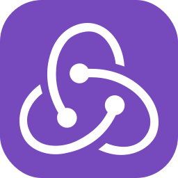

  

  
  
  

  
  
  <!-- Replace with your real email & LinkedIn -->
  
  

---

## About Me

Creative Front-End Developer with strong focus on **MERN Stack** and **eCommerce Theme Development**.
I build fast, scalable, and conversion-focused experiences for Gulf & global markets.

- 🌱 Currently leveling up in **Next.js** and **Web Accessibility**
- 🔭 Building themes and web apps with **performance + scalability** in mind
- 🎯 Clean, concise code that balances **aesthetics** with **functionality**
- 👥 Frontend Team Lead: mentoring, code reviews, delivery planning, and quality enforcement

---

## Platforms I Work With

  
  
  

---

## Tech Stack (Fast Icons)

  

---

## Tech Logos (Your Custom Assets)
> Put all icons inside `./assets/` in this same repo to make them render correctly.

  
  
  
  
  
  
  
  
  
  
  
  
  
  
  
  

  
  
  
  
  
  

---

## Featured Work

- **Piano** & **Tera** — premium UI, fast performance, and polished shopping experience.
- **Fakhr** & **Style** — advanced customization and smooth management for large stores.
- **Chic** + **8 Custom Themes** — strong brand identity and measurable business impact.

---

## GitHub Stats

  
  

  
  

---

## WakaTime (Coding Activity)
<!-- If it doesn't show, just change username to your exact WakaTime username -->

  

---

## Contribution Graph

  

---

## Pinned Projects (Cards)
<!-- Replace repo names with your real best repos -->

  
  

  
  

---

## GitHub Trophies

  

---

## Snake (Contribution Animation)
<!-- Requires GitHub Action (optional). If you set it up, the file will exist in /output -->

  

---

## Testimonials

  
<b>Open Testimonials</b>

   

  <b>Theme Piano & Theme Tera</b> 
  “Working with Mohamed on Theme Piano and Theme Tera was one of the best decisions we made. He engineered a premium experience that feels fast, consistent, and conversion-focused. Details, performance, and delivery were all top-tier.”

    

  <b>Theme Fakhr & Theme Style</b> 
  “Mohamed delivered two of our most customized themes with high stability and excellent management experience. He handled complex requirements cleanly, kept everything scalable, and raised the overall reputation of the themes.”

    

  <b>Theme Chic + 8 Custom Themes</b> 
  “Mohamed built Theme Chic and 8 custom themes that became a major success for our business. Strong brand identity, better UX, and real growth impact. Reliable timelines and consistently high-quality delivery.”

    

  <b>Team Feedback (Large Accounts)</b> 
  “Mohamed is dependable, communicates clearly, and takes full ownership. He leads frontend delivery with clean standards, mentors the team, and consistently ships production-ready results under pressure.”

---

## Let’s Work Together

- WhatsApp: https://wa.me/201558208320
- Telegram: https://t.me/mohamed_shahien125
- Email: yourmail@example.com
